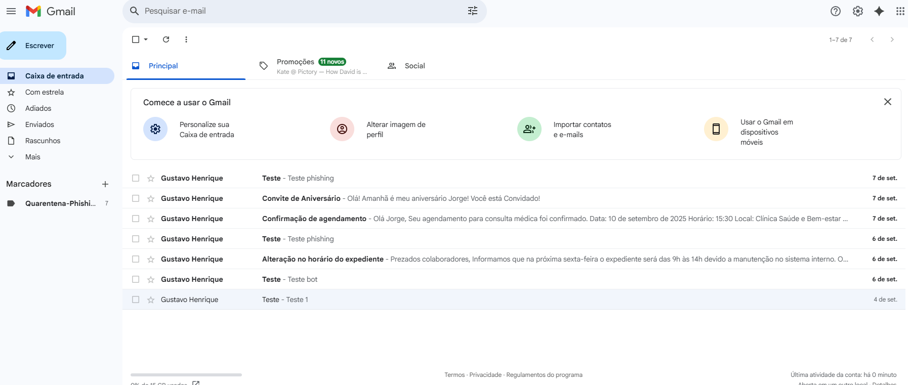
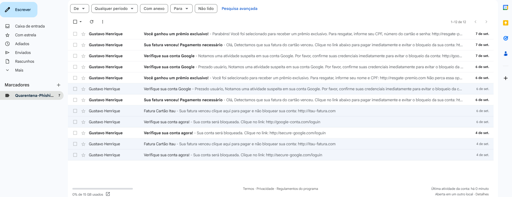
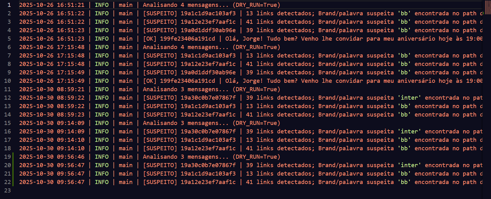
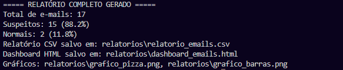
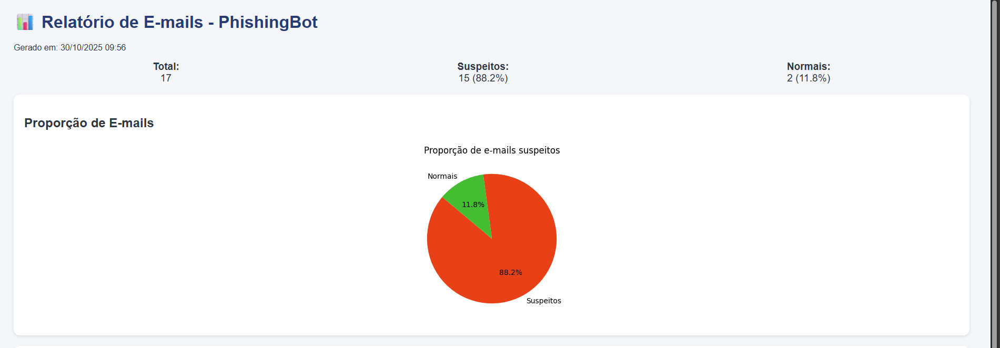
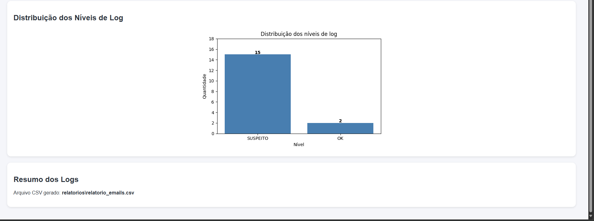
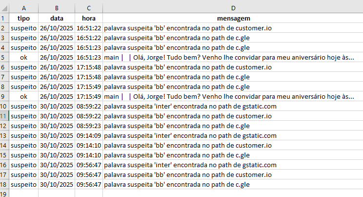

# 🛡️ Phishing Detection Bot

Um projeto para identificar e sinalizar e-mails potencialmente maliciosos, utilizando integração com a **Gmail API**, **modelo de Machine Learning**, heurísticas e IA (**Google Gemini**) para análise de conteúdo.  
O sistema pode ser adaptado para diferentes provedores de e-mail e está preparado para análises automatizadas de phishing.

---

## 🔐 Sobre Cibersegurança e Phishing

A **Cibersegurança** é a prática de proteger sistemas, redes e dados contra ataques digitais.  
Entre as ameaças mais comuns, o **Phishing** é um método fraudulento usado para enganar pessoas e obter informações sensíveis, como senhas, dados bancários e informações pessoais.

No Phishing, criminosos se passam por entidades legítimas, geralmente por e-mail, para induzir a vítima a clicar em links maliciosos ou abrir anexos infectados.

### 📌 Tipos Comuns de Phishing

| Tipo | Descrição |
|------|-----------|
| 📨 **Phishing Tradicional** | E-mails genéricos enviados em massa com links fraudulentos |
| 🎯 **Spear Phishing** | Ataques direcionados a indivíduos ou empresas específicas |
| 🐋 **Whaling** | Focado em executivos ou pessoas de alto escalão |
| 🔗 **Clone Phishing** | Cópia de mensagens legítimas com links maliciosos |
| 📱 **Smishing** | Phishing via SMS |
| 📞 **Vishing** | Phishing por chamadas de voz |

> Este projeto atua como uma **camada de defesa**, bloqueando ataques antes que causem danos.

---

## 🚀 Funcionalidades

### 📧 Conexão com Gmail
- Integração via **OAuth2** para acesso seguro aos e-mails
- Suporte à leitura e análise em tempo real
- Compatível com labels personalizados e quarentena automática

### 🔍 Detecção Heurística
- Identificação de **domínios suspeitos e TLDs maliciosos**
- Verificação de **palavras sensíveis** (CPF, senha, prêmio, cartão etc.)
- Detecção de **linguagem de urgência e golpes de pagamento imediato**
- Análise de headers, remetentes e links presentes no corpo do e-mail

### 🧠 Machine Learning
- Classificação automática com **Random Forest + TF-IDF**
- Utiliza **4 features adicionais** de segurança comportamental
- Detecção aprimorada de e-mails de phishing disfarçados
- Treinável com base em datasets personalizados

### 🤖 Integração com IA
- Conexão com **Google Gemini** para análise semântica e moderação inteligente
- Interpretação contextual de mensagens, links e intenções
- Avaliação híbrida **(Heurística + ML + IA)** para máxima precisão

### 📝 Registro e Logs
- Sistema de log detalhado com níveis **[OK], [SUSPEITO], [QUARENTENA], [INFO], [ERROR]**

- Cada detecção é registrada com **data, hora e motivo do alerta**
- Exportação automática para **CSV**
- Suporte para auditoria e rastreabilidade de eventos

### 📊 Relatórios e Dashboards

- Geração automática de **relatórios completos** em /relatorios/
- Exporta planilhas .csv com colunas: tipo, data, hora e motivo do alerta
- Gera **gráficos automáticos**:
    - 🍕 Gráfico de pizza — proporção de e-mails suspeitos
    - 📊 Gráfico de barras — distribuição dos níveis de log

- Cria **dashboard HTML interativo**, com:
- Estatísticas resumidas
- Imagens de gráficos incorporadas
- Design moderno e responsivo
- Data e hora da geração

### ⚡ Modos Especiais
- **DRY_RUN**: simulação sem mover e-mails  
- Preparado para quarentena e aplicação de labels automáticos no Gmail  

---

## 📦 Requisitos

- **Python 3.9+**  
- Conta **Google Cloud** com **Gmail API** habilitada  
- **Dataset** de phishing (CSV)
- **Instalar** dependências listadas no requirements.txt:
    - Comando: **pip install -r requirements.txt** 

- Arquivos de autenticação:
    - **token.json** (gerado após autorizar acesso à Gmail API)
    - **credentials.json** (credenciais do OAuth da Gmail API)
    - **vertex.json** (credenciais para Vertex AI / Gemini)
---

## 📊 Gmail

O sistema acessa sua caixa de entrada do Gmail, analisa os emails e classifica automaticamente os que forem suspeitos.
Todos os emails detectados como phishing são movidos para uma label exclusiva chamada “Quarentena Phishing”.


- **Caixa de entrada:**


- **Quarentena Phishing:**


---

## Log



---

## Relatório e Dashboard:









---

## 🔮 Próximos Passos

- Aprimoramento contínuo do modelo ML com **novos datasets**  
- Suporte a **outros provedores de e-mail** e alertas corporativos  

---

```mermaid
flowchart TD
    A[📥 Receber E-mails] --> B{O remetente é confiável?}
    B -- Sim --> C[📌 Classificar como seguro]
    B -- Não --> D{Domínio na lista suspeita?}
    D -- Sim --> E[🚨 Marcar como phishing]
    D -- Não --> F[🔍 Analisar padrões]
    F -- Suspeito --> E
    F -- Seguro --> C
    E --> G[📝 Registrar e alertar]
    C --> H[✅ Finalizar verificação]

  
